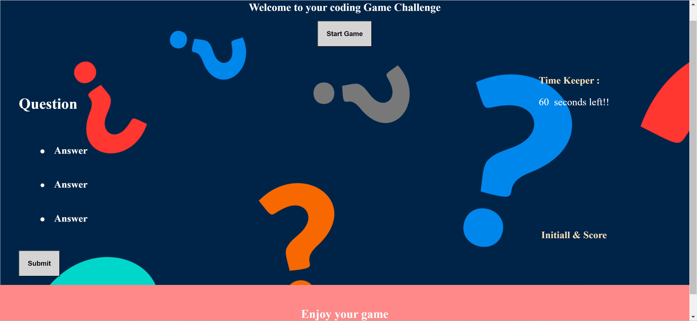

# Code Quiz

Table of Contents:

    1. Overview
    2. Description
    3. Technologies Used
    4. Usage
    5. App Screenshots
    6. Mock-Up
    7. Github
    8. Email

## Overview

`The Interactive Quiz Application is a web-based quiz game designed to engage users with a series of questions while challenging their knowledge and time management skills. This project provides an interactive and enjoyable quiz experience, including timer functionality and score tracking.`

## Description

```
User Interaction Flow: Interactive Quiz Application

Initiation

Action: Click the "Start" button.
Result: A timer initiates, and a question is presented.
Question Progression

Action: Answer a question.
Result: Upon answering, another question is presented.
Incorrect Answer Handling

Action: Provide an incorrect answer.
Result: Time is deducted from the timer.
Game Termination Conditions

Action: Complete all questions or let the timer reach 0.
Result: The game concludes.
Post-Game Actions

Action: Game ends.
Result: Option to save initials and recorded score becomes available.
This user interaction flow outlines the sequence of actions and outcomes in an interactive quiz application.

```

## Technologies Used

```
HTML: Utilized for structuring the content and layout of webpages, ensuring proper organization and accessibility.

CSS: Applied for styling, enhancing the visual appeal, and ensuring responsive design elements to create an engaging user experience.

JavaScript: Implemented to add interactivity and dynamic behavior to web applications, enhancing user engagement and functionality.
```

## Usage

To access the website, simply [visit my website](https://abou2022.github.io/codeQuiz/). Feel free to resize the page or view it on various screens and devices to observe the responsive layout in action.

## App Screenshots



## Mock-Up

The following animation demonstrates the application functionality:


## Github

You are encouraged to make contributions to this project by submitting a Git pull request on my [Github](https://github.com/Abou2022/codeQuiz). Your suggestions and contributions will be warmly welcomed and appreciated. Thank you for your valuable input and support.

## Email

Should you have any questions, please don't hesitate to reach out via email my [Email](mailto:syllabakary2002@gmail.com). Your inquiries are welcome, and I'm here to assist you.

---

© 2022 Bakary sylla, Inc. brand. Confidential and Proprietary. All Rights Reserved.
